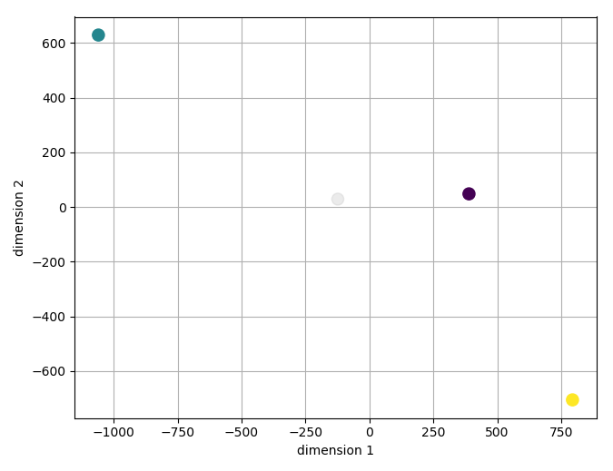

[](https://travis-ci.org/iosonofabio/singlet)
[](http://singlet.readthedocs.io)


# Singlet
Single cell RNA-Seq analysis.

## Requirements
Python 3.4+ is required. Moreover, you will need:
- pyyaml
- numpy
- scipy
- pandas
- scikit-learn
- matplotlib
- seaborn
- bhtsne (for t-SNE dimensionality reduction)

Get those from pip or conda.

## Install
TODO: upload on pypi.

For the time being, you can clone the git repo and then call:
```bash
python3 setup.py install
```

## Usage example
You can have a look inside the `test` folder for examples. To start using the example dataset:
- Set the environment variable `SINGLET_CONFIG_FILENAME` to the location of the example YAML file
- Open a Python/IPython shell and type:

```python
from singlet.dataset import Dataset
ds = Dataset(samplesheet='example_sheet_tsv', counts_table='example_table_tsv')

ds.counts = ds.counts.iloc[:200]
vs = ds.dimensionality.tsne(
        n_dims=2,
        transform='log10',
        theta=0.5,
        perplexity=0.8)
ax = ds.plot.scatter_reduced_samples(
        vs,
        color_by='quantitative_phenotype_1_[A.U.]')
plt.show()
```

This will calculate a t-SNE embedding of the first 200 features and then show your samples in the reduced space. It should look like this:



